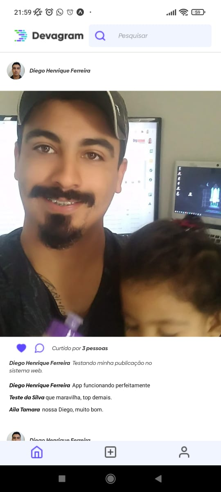

<h1 align="center">Devagram</h1>

  

  <a href="#-sobre">Sobre</a>&nbsp;&nbsp;&nbsp;|&nbsp;&nbsp;&nbsp;
  <a href="#-projeto">Projeto</a>&nbsp;&nbsp;&nbsp;|&nbsp;&nbsp;&nbsp;
  <a href="#-tecnologias">Tecnologias</a>&nbsp;&nbsp;&nbsp;|&nbsp;&nbsp;&nbsp;
  <a href="#-licença">Licença</a>&nbsp;&nbsp;&nbsp;|&nbsp;&nbsp;&nbsp;
  <a href="#-autor">Autor</a>

  
  

## ✨ Sobre

Projeto desenvolvido nas aulas da plataforma [Devaria](https://www.devaria.com.br).
Todo o conteúdo da plataforma é gratuito e o ensino vai do básico ao avançado, com trilhas completas para desenvolvimento.
Na plataforma existem trilhas de Frontend, Backend, Mobile e Fullstack.

## ✨ Projeto

  

O Projeto desenvolvido foi um clone do Instagram, onde criamos o backend com Nodejs e Nextjs e o frontend foi desenvolvido com Reactjs e Nextjs.

> Obs.: O projeto está inteiramente publicado (backend, frontend e mobile)

### Backend

- [Backend](https://github.com/diegohfcelestino/devagram/tree/main/devagram-node-nextjs)
Criamos o backend da aplicação utilizando NodeJS com o Nextjs. Nesse projeto utilizou o Typescript, que auxilia no aumento da produtividade em desenvolvimento, utilizamos o Mongose, para trabalhar com banco de dados e integrar com o Mongo Atlas (que é o MongoDB online), utilizamos o multer e o cosmic para trabalhar com upload de imagens e também inserimos política de CORS.

### Frontend    

- [Frontend](https://github.com/diegohfcelestino/devagram/tree/main/devagram-react-nextjs)
O frontend web da nossa aplicação utilizamos o ReactJS também com o Nextjs. Nesta parte de projeto utilizamos o Javascript, Sass para criar os estilos, axios para chamadas http, utilizamos o HOC (Higher-Order Component), para reutilizar os componentes e dar autorização nas páginas de acesso.

### Mobile    

- [Mobile](https://github.com/diegohfcelestino/devagram/tree/main/devagram-react-native-expo)
O mobile foi construido com o React-native utilizando o expo, para renderização mais rápida e pelo dispositivo móvel (durante o desenvolvimento). Nele foi utilizado typescript, axios para chamadas http, image picker para trabalhar com imagens e tudo separado em componente para reaproveitamento do código.

## ✨ Tecnologias 

- [Nextjs](https://nextjs.org/)
- [Nodejs](https://nodejs.org/en/)
- [Reactjs](https://reactjs.org/)
- [React-native](https://reactnative.dev/)
- [Expo](https://expo.dev/)
- [Typescript](https://www.typescriptlang.org/)
- [Javascript](https://www.javascript.com/)
- [MongoDB](https://www.mongodb.com/)
- [Moment](https://momentjs.com/)
- [JWT](https://jwt.io/)
- [MD5](https://www.md5hashgenerator.com/)
- [Multerjs](https://www.npmjs.com/package/multer)
- [Cosmicjs](https://www.cosmicjs.com/)
- [SASS](https://sass-lang.com/)
- [Axios](https://axios-http.com/ptbr/docs/intro)
  

O projeto pode ser clonado e executado localmente.

## 📄 Licença

Esse projeto está sob a licença MIT.

---

## ✨ Autor

Feito por **Diego Henrique Ferreira** seguindo a trilha de Fullstack na plataforma da [Devaria](https://www.devaria.com.br).
Entre em contato!

👋🏻 &nbsp;[Participe da comunidade!](https://www.facebook.com/groups/devaria)